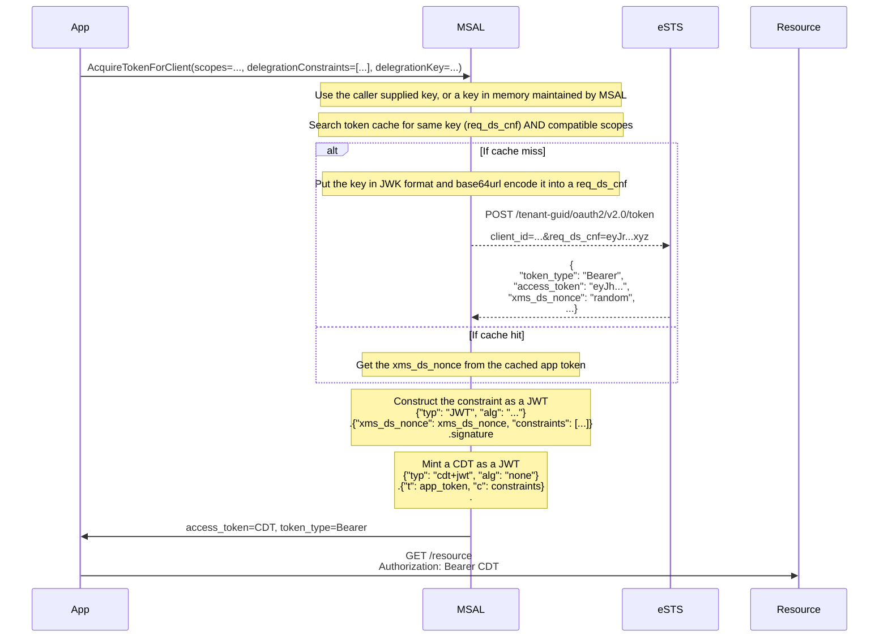

```mermaid
sequenceDiagram
    App->>MSAL: AcquireTokenForClient(scopes=..., delegrationConstraints=[...], delegrationKey=...)
    note over MSAL: Use the caller supplied key, or a key in memory maintained by MSAL
    note over MSAL: Search token cache for same key (req_ds_cnf) AND compatible scopes
    alt If cache miss
    note over MSAL: Put the key in JWK format and base64url encode it into a req_ds_cnf
    MSAL-->>eSTS: POST /tenant-guid/oauth2/v2.0/token<br/><br/>client_id=...&req_ds_cnf=eyJr...xyz
    eSTS-->>MSAL: {<br/>  "token_type": "Bearer",<br/>  "access_token": "eyJh...",<br/>  "xms_ds_nonce": "random",<br/>...}
    else If cache hit
    note over MSAL: Get the xms_ds_nonce from the cached app token
    end
    note over MSAL: Construct the constraint as a JWT<br/>{"typ": "JWT", "alg": "..."}<br/>.{"xms_ds_nonce": xms_ds_nonce, "constraints": [...]}<br/>.signature
    note over MSAL: Mint a CDT as a JWT<br/>{"typ": "cdt+jwt", "alg": "none"}<br/>.{"t": app_token, "c": constraints}<br/>.
    MSAL->>App: access_token=CDT, token_type=Bearer
    App->>Resource: GET /resource<br/>Authorization: Bearer CDT
```

